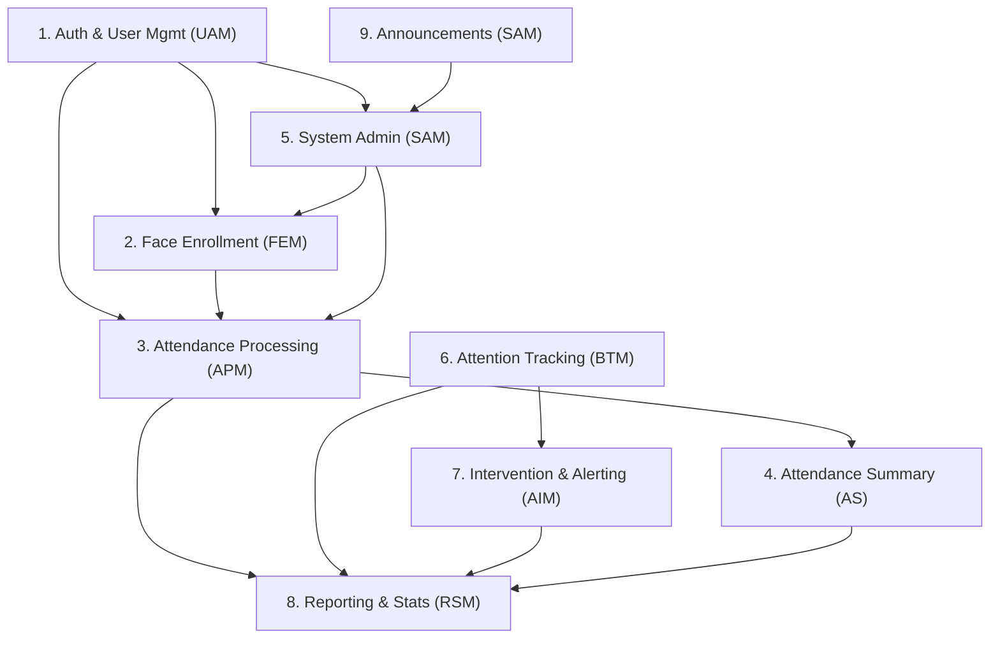

# Smart Attendance System — Comprehensive Project Audit Report

**Date:** 2026-06-04  
**Auditor:** Antigravity AI Agent  
**Source of Truth:** User stories provided in the request + codebase at `c:\Users\Hashir Mehboob\Desktop\smart-attendance-system`

> [!IMPORTANT]
> The three documentation files (`docs/project_overview.md`, `docs/requirements_specification.md`, `docs/system_architecture.md`) are **all empty** (0 bytes). This audit therefore uses the **user stories provided in the request** as the documented specification and cross-references them against the **implemented codebase**.

---

## 1. Project Module Analysis

### 1.1 Total Modules: **9**

| # | Module | Abbreviation | Purpose |
|---|--------|-------------|---------|
| 1 | Authentication & User Management | UAM | Login, logout, password reset, role management, profile pictures, student sign-up |
| 2 | Student Registration — Face Enrollment | FEM | Student data entry, webcam face capture, embedding generation, bulk upload, quality validation |
| 3 | Attendance Processing Module | APM | Real-time face detection, recognition via embeddings, auto-marking Present/Absent, manual overrides |
| 4 | Attendance Summary | AS | Filtered views, attendance percentages, CSV export, trend charts, poor attendance reports |
| 5 | System Administration | SAM-Admin | Course/subject management, DB backups, CI/CD, system health monitoring, RBAC, audit logs, SIS import |
| 6 | Behavioural Attention Tracking Model | BTM | Head pose analysis, real-time attention scores, posture/sleepiness detection, class engagement average |
| 7 | Academic Intervention & Alerting Module | AIM | Low engagement alerts, risk lists, custom thresholds, centralized alert log, notification config, heatmaps |
| 8 | Reporting & Statistical Summary Module | RSM | Real-time dashboards, engagement summaries, at-risk reports, CSV/PDF generation, heatmaps, student portal |
| 9 | Announcements / System Management | SAM | Course CRUD, backups, CI/CD pipelines, system health, RBAC, audit logs, SIS data import |

> [!NOTE]
> Modules 5 (System Administration) and 9 (Announcements/System Management) share nearly identical user stories (AS-01 through AS-06 vs SAM-01 through SAM-07). They are treated as partially overlapping modules below.

### 1.2 Module Dependencies

---

## 2. Completion Assessment

### 2.1 Module-Level Status

| Module | Status | Detail |
|--------|--------|--------|
| 1. Authentication & User Management (UAM) | ❌ Not Started | `auth.py` is empty (0 bytes). No login, logout, password reset, RBAC, or session management exists. |
| 2. Face Enrollment (FEM) | 🟡 Partially Completed (~55%) | Frontend forms, webcam capture, bulk upload UI, and student registry table are built. Backend `ml_service.py` has enrollment logic with mocked embeddings. **Missing:** real FaceNet/ArcFace model, actual DB storage, image quality feedback UI, re-enrollment history logging. |
| 3. Attendance Processing (APM) | 🟡 Partially Completed (~40%) | Frontend `LiveClassroom.jsx` has webcam feed, simulated face detection with bounding boxes, manual override, and session finalization. Backend has WebSocket endpoint. **Missing:** real face recognition (currently random), actual embedding comparison, database persistence, proper session management API. |
| 4. Attendance Summary (AS) | 🟡 Partially Completed (~35%) | `ReportsLogs.jsx` shows session archives, attendance rates, trend bars, export buttons. **Missing:** date/subject filtering, actual student percentage calculations, CSV export (currently mock toast), poor attendance report (<75%), "Last Seen" timestamps. |
| 5. System Administration (SAM-Admin) | ❌ Not Started | `SystemSettings.jsx` is a placeholder (1 line). No system health dashboard, backup functionality, RBAC panel, or audit log viewer. |
| 6. Behavioural Attention Tracking (BTM) | ❌ Not Started | `AttentionAnalysis.jsx` is a placeholder (1 line). No head pose detection, attention scoring, posture analysis, or engagement models exist in the ML module. |
| 7. Academic Intervention & Alerting (AIM) | ❌ Not Started | No alerting system, risk list generation, threshold configuration, heatmap, or notification channel management exists anywhere. |
| 8. Reporting & Statistical Summary (RSM) | 🟡 Partially Completed (~25%) | `ReportsLogs.jsx` provides basic session archive viewing. Dashboard home shows aggregate stats. **Missing:** engagement summaries, at-risk monthly reports, automated CSV/PDF generation, student personal portal, focus heatmaps. |
| 9. Announcements / System Management | ❌ Not Started | `course-dashboard/` directory is empty. No announcement system, CI/CD pipeline management, or SIS import functionality. |

### 2.2 User Story Coverage Detail

#### Module 1: Authentication & User Management (UAM)

| ID | Story Summary | Status |
|----|--------------|--------|
| UAM-01 | Teacher/admin login | ❌ Not Started |
| UAM-02 | Logout & session destroy | ❌ Not Started |
| UAM-03 | Instructor bio | ❌ Not Started |
| UAM-04 | Password reset | ❌ Not Started |
| UAM-05 | Role management (RBAC) | ❌ Not Started |
| UAM-06 | Student sign-up & login | ❌ Not Started |
| UAM-07 | Profile picture upload | ❌ Not Started |

#### Module 2: Face Enrollment (FEM)

| ID | Story Summary | Status |
|----|--------------|--------|
| FEM-01 | Student basic info registration | ✅ Completed (frontend form with validation) |
| FEM-02 | Multi-angle webcam capture | 🟡 Partial (webcam works, no angle guidance) |
| FEM-03 | Convert to 128-d embeddings | 🟡 Partial (mock embeddings, no real model) |
| FEM-04 | Bulk photo upload (ZIP) | 🟡 Partial (UI exists, mock processing) |
| FEM-05 | Enrolled student gallery | ✅ Completed (searchable datatable) |
| FEM-06 | Quality validation (blur/lighting) | 🟡 Partial (Laplacian blur check in backend, no real-time UI feedback) |
| FEM-07 | Re-enroll / update face data | ❌ Not Started |

#### Module 3: Attendance Processing (APM)

| ID | Story Summary | Status |
|----|--------------|--------|
| APM-01 | Real-time face detection with bounding boxes | 🟡 Partial (canvas overlay works, detection is simulated) |
| APM-02 | Face matching via embeddings | ❌ Not Started (random matching only) |
| APM-03 | Label unknowns | 🟡 Partial (simulated unknown tagging, no security log DB) |
| APM-04 | Auto-mark Present | 🟡 Partial (localStorage-based, no real DB) |
| APM-05 | Mark Absent at session close | 🟡 Partial (roster diffing exists, localStorage only) |
| APM-06 | Manual override | ✅ Completed (toggle switch in frontend) |
| APM-07 | Optimized lightweight model | ❌ Not Started (no model optimization) |

#### Module 4: Attendance Summary (AS)

| ID | Story Summary | Status |
|----|--------------|--------|
| AS-01 | Filtered attendance summary | 🟡 Partial (search by session ID, no date/subject filter) |
| AS-02 | Student attendance percentage | 🟡 Partial (calculated in StudentManagement, not in dedicated view) |
| AS-03 | CSV export | ❌ Not Started (toast mock only) |
| AS-04 | Visual trend chart | 🟡 Partial (static hardcoded bar chart, no real data) |
| AS-05 | Poor attendance report (<75%) | ❌ Not Started |
| AS-06 | "Last Seen" timestamp | ❌ Not Started |

#### Module 5: System Administration — All 6 stories ❌ Not Started

#### Module 6: Behavioural Attention Tracking (BTM) — All 7 stories ❌ Not Started

#### Module 7: Academic Intervention & Alerting (AIM) — All 7 stories ❌ Not Started

#### Module 8: Reporting & Statistical Summary (RSM)

| ID | Story Summary | Status |
|----|--------------|--------|
| RSM-01 | Real-time attendance dashboard | 🟡 Partial (DashboardHome shows stats from localStorage) |
| RSM-02 | Engagement summary per class | ❌ Not Started |
| RSM-03 | Monthly at-risk report | ❌ Not Started |
| RSM-04 | Automated daily CSV/PDF | ❌ Not Started |
| RSM-05 | Heatmap of student focus | ❌ Not Started |
| RSM-06 | Periodic email summary | ❌ Not Started |
| RSM-07 | Student personal portal | ❌ Not Started |

#### Module 9: Announcements / System Management — All 7 stories ❌ Not Started

---

## 3. End-to-End Integration Verification

| Module | Status | Integrated? | End-to-End Working? | Notes |
|--------|--------|-------------|---------------------|-------|
| Auth & User Mgmt (UAM) | ❌ Not Started | ❌ No | ❌ No | No auth exists. All dashboard pages are unprotected. No roles, no sessions. |
| Face Enrollment (FEM) | 🟡 Partial | 🟡 Partial | ❌ No | Frontend form → localStorage → Student registry works. Backend ML service exists but uses mock embeddings. No DB integration. |
| Attendance Processing (APM) | 🟡 Partial | 🟡 Partial | ❌ No | LiveClassroom reads enrolled students from localStorage, simulates detection, saves session logs to localStorage. Backend WebSocket endpoint exists but is not connected to frontend. |
| Attendance Summary (AS) | 🟡 Partial | 🟡 Partial | ❌ No | ReportsLogs reads session logs from localStorage. Export functionality is mocked. No real DB queries or filtering. |
| System Administration | ❌ Not Started | ❌ No | ❌ No | Placeholder page only. |
| Behavioural Attention Tracking (BTM) | ❌ Not Started | ❌ No | ❌ No | Placeholder page only. No ML models. |
| Intervention & Alerting (AIM) | ❌ Not Started | ❌ No | ❌ No | No implementation at all. |
| Reporting & Stats (RSM) | 🟡 Partial | 🟡 Partial | ❌ No | DashboardHome and ReportsLogs show data from localStorage. No real analytics engine. |
| Announcements / System Mgmt | ❌ Not Started | ❌ No | ❌ No | Empty directory. Course management is in CourseDashboard (frontend only, localStorage). |

> [!CAUTION]
> **No single end-to-end flow is fully functional.** All data flows use `localStorage` as a mock database. The backend API has only 2 endpoints (`POST /enroll` and `WS /detect`), and the frontend does not actually call them — it operates entirely on client-side simulated data.

---

## 4. Gap Analysis

### 4.1 Modules Not Yet Developed (5 of 9)

1. **Authentication & User Management** — Zero implementation
2. **System Administration** — Placeholder only
3. **Behavioural Attention Tracking** — Placeholder only
4. **Academic Intervention & Alerting** — Zero implementation
5. **Announcements / System Management** — Empty directory

### 4.2 Features Missing Inside Partially Completed Modules

| Module | Missing Features |
|--------|-----------------|
| Face Enrollment | Real FaceNet/ArcFace model integration, persistent DB storage, angle-guided capture, real-time quality feedback UI, re-enrollment with audit history |
| Attendance Processing | Real face recognition (not random), embedding comparison engine, proper session management API, database persistence, unknown face security logging |
| Attendance Summary | Date/subject filtering, real CSV export, dynamic attendance percentages, poor attendance threshold report, "Last Seen" timestamp |
| Reporting & Stats | Engagement summaries, at-risk reports, automated file generation, student portal, focus heatmaps |

### 4.3 Critical Integration Tasks Pending

| Integration | Status |
|-------------|--------|
| Frontend ↔ Backend API | ❌ Frontend does not call any backend endpoints |
| Backend ↔ Database | ❌ No database configured (no MongoDB/PostgreSQL connection) |
| Backend ↔ ML Model | 🟡 `ml_service.py` exists with mock embeddings |
| Authentication guard on routes | ❌ All routes are publicly accessible |
| WebSocket real-time pipeline | ❌ Backend endpoint exists but frontend doesn't use it |
| Reporting ↔ Database queries | ❌ Reports read from localStorage |
| CI/CD pipeline | ❌ Docker/K8s manifests exist as empty files |

### 4.4 High-Priority Items Before Deployment

1. **Database layer** — No database exists at all
2. **Authentication & Authorization** — No protection on any route
3. **Real face recognition model** — All detection/matching is mocked
4. **Frontend-Backend integration** — Frontend is fully disconnected from backend
5. **Data persistence** — All data lives in browser localStorage

### 4.5 Summary Counts

| Metric | Count |
|--------|-------|
| **Total Modules** | 9 |
| **Fully Completed** | 0 |
| **Partially Completed** | 4 (FEM, APM, AS, RSM) |
| **Not Started** | 5 (UAM, SAM, BTM, AIM, Announcements) |
| **Total User Stories** | 55 |
| **Completed Stories** | 3 (FEM-01, FEM-05, APM-06) |
| **Partially Completed Stories** | 14 |
| **Not Started Stories** | 38 |
| **Estimated Development Phases Remaining** | 5–6 major phases |

---

## 5. Deployment Readiness Assessment

| Criterion | Ready? | Detail |
|-----------|--------|--------|
| Authentication | ❌ | No auth system |
| Database | ❌ | No database configured or connected |
| API completeness | ❌ | 2 endpoints exist; ~20+ needed |
| Frontend-backend integration | ❌ | Frontend operates on localStorage mocks |
| ML model deployment | ❌ | Mock embeddings; no real model |
| Infrastructure | ❌ | Docker/K8s files are empty stubs |
| Testing | ❌ | Test directories exist but contain no tests |
| Security | ❌ | CORS allows `*`, no auth, no RBAC |
| Monitoring | ❌ | No system health monitoring |

> [!CAUTION]
> **Deployment Readiness: NOT READY.** The project is at a **prototype/UI-scaffold stage** (~15-20% overall completion). It demonstrates UI flows with simulated data but has no functional backend, no database, no real ML models, and no authentication.

---

## 6. Development Roadmap (Estimated Phases)

### Phase 1: Foundation (High Priority)
- Database setup (PostgreSQL/MongoDB) with ORM models
- Authentication system (JWT-based login/logout/password reset)
- RBAC middleware
- Backend config and environment management

### Phase 2: Core ML Pipeline
- Integrate real face recognition model (FaceNet/ArcFace/MobileFaceNet)
- Embedding generation and persistent storage
- Face detection optimization for CPU
- WebSocket real-time frame processing pipeline

### Phase 3: Attendance System
- Connect frontend to backend APIs
- Session management (create, close, roster)
- Real attendance marking with DB persistence
- CSV/PDF export functionality

### Phase 4: Attention Tracking & Alerting
- Head pose estimation model
- Real-time attention scoring
- Alert system with configurable thresholds
- Risk list generation

### Phase 5: Reporting & Administration
- Comprehensive reporting dashboards
- Student personal portal
- System administration panel
- Automated report generation
- Backup/restore functionality

### Phase 6: Deployment & QA
- Docker containerization
- CI/CD pipeline
- End-to-end testing
- Security audit
- Performance optimization
